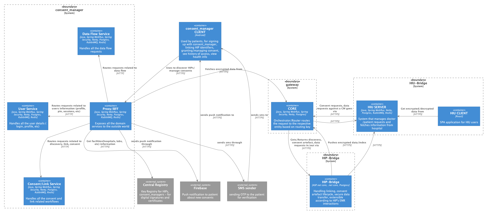

# HDAF 

Fiduciary/Trustee that manages patient consents, information flow between HIP and HDAF Clients
(HIU and Patient centric Mobile App)

## Components

## System Architecture

## HDAF Architecture

* [System Architecture](./docs/architecture.md)

# Pre-requisites & Setting up the environment

 * Git (also setup SSH Key)
 * Intelli Idea IDE
   * Install Lombok Plugin in the IDE and enable Lombok Annotations in preferences
 
## Import the project
When using IntelliJ Idea, open this project by importing the gradle file and check `Auto Import` option to resolve 
all the dependencies automatically.

## Commands to Know

### `make png`
Generates PNGs for all `*.puml` files located in `docs/diagrams` and `<project>/docs/diagrams`.
