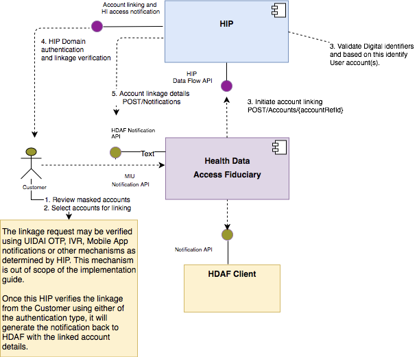

# Summary of tech specification

* Each HIP must maintain a record of accounts that have been linked to a consent manager account of the customer, and must share information with the Consent Manager (and through it, with HIUs) only from accounts that have been linked (upon presentation of an appropriate consent artefact).

> **Customer-Address:** All consent manager account addresses are denoted as “account@provider" form. Address should only contain a-z, A-Z, 0-9, .(dot), - (hyphen). ``<Customer_identifier>@<consent_manager_identifier>``

> consent is always electronically sought from the Customer and is captured using a digital object called the ``“Consent Artefact”``

## Consent Artefact

  ```
      Identifiers:
        HIU, HIP, Consent Manager, Customer
      Permission:
        HITypes
        access-permission:
          Duration of data shared (duration for which information is requested)
          dataTime (allowed duration of storage by Health Information)
          type: VIEW  | STORE | STREAM | QUERY
      Purpose of access: (Refer page 17)
        Include application domain (Health Insurance) + entity (claims processing)
          -> using suitable codes / Free form text
      Signature:
        Digitally Signed by Consent Manager (W3C Recommendations XML)
        
   ```
* Four access types VIEW [^1], STORE [^2] , STREAM [^3] , QUERY [^4]
* Create two consent artefacts (Refer page 14)
   * Consent Artefact XML between HIU/Customer and Consent Manager
   * Consent Artefact XML between Consent Manager and HIP
 * Refer page 15 for HIT and it's FHIR Mapping
## Use cases of Consent Manager
   1. Discover accounts
   2. Link HIP accounts
   3. Authorise Consent
   4. Request Health Information
   5. Consent History Query
   6. Revoke Consent

### Discover Accounts

> Consent Manager, based on input from the customer, passes a **verified digital identifier** such as *a Mobile Number, HIP Issued Patient ID, Aadhaar Number/Aadhaar Virtual ID, or ePAN*. to the ``“POST /Accounts”`` API of the HIP to obtain a list of masked account numbers.

**Customer consent can only be generated for linked accounts**

**Masking of account numbers is performed based on the HIPs discretion**

> In the Account Discovery request, the Consent Manager must mark all identifiers it has verified, that includes strong identifiers, weak identifiers and custom non-verifiable functional identifiers that the customer provides. The HIP must only respond if all of the strong identifiers match the record of the customer.

### Link HIP Accounts at Consent Manager

* Linking



> All account linking requests should be logged.

* Delinking

  * Account delinking initiated at Consent Manager
  * Account delinking at HIP, such as in case of customer request to HIP, account closure and other internal events in the HIP domain. ``" DELETE Accounts/link "``

### Create Consent Artefact(s) (Consent Manager)

* HIP maintains the most up to date status of the pertinent Consent Artefacts.
* HIU or the Consent Manager Client will request the Consent Manager Consent Flow API method ``“ POST/Consents ”``
> The Consent Manager may generate a consent completed notification back to the requester (in the case of the HIU, this would involve using the ``“ POST /Notification ” `` API)

* ``“ GET /Consents/Consent/{id} ”`` API on the Consent Manager. The Consent Manager must validate the HIU/Consent Manager client and only respond with consent artefact that corresponds tothese entities.
* ``“ GET /Consents/{consentRefNumber} ”`` method provides a mechanics for the Consent Manager client (or HIU) to obtain the status of the Consents Artefact(s) id generated in the “Consent Creation” request.

* Security Requirements
    1. The Consent Artefact(s) are digitally signed 
    2. The HIP maintains the status (active, revoked, etc) of the Consent Artefacts.
    3. All Consent creation requested must be logged.

### Request Health Information

* HIP Validate following Consent details before sending the data back to Consent Manager
  * verifying the embedded signature
  * checking for timeliness of the request
* Request must specify the time instant (capture time) for which information is being requested
  
* Consent Artefact Verification and Validation
  * Consent Artefact must be verified when HIP receives it from Consent Manager. Verification steps consist of:
    1. Verify the credentials of the Consent Manager
    2. Verify Consent Artefact is associated with the authorised customer
    3. Verify that the Artefact is valid, is in active state and contains all mandatory information
  * Consent Artefact must be validated every time information is requested based on the consent. The artefact is deemed valid if:
    1. The capture time given in the request lies between the creation time (create time) and the expiry time (expire time) of the artefact and is either the same as the time at which the request is received or is prior to the time at which the request is received.
    2. Consent has not been revoked based on the Revocation List maintained by the HIP (details of which have been specified in the section on Consent Revocation)


> The HIU makes a request for health information (Refer page 29)
> HIU includes the **encryption parameters** and the target recipient in the request using the ``“ POST /HI/request ”`` API.

* The Consent Manager verifies the Consent Artefact(s) provided by the HIU:
   1. Verifies the status of the Consent Artefact(s) and their validity.
   2. Verifies that all accounts are still linked for the customer. For accounts that are no longer linked, **revokes the Consent Artefact(s) and notifies the HIU and HIP.**
   
* For each HIP from which health information needs to be aggregated
  1. The Consent Manager constructs the health information request, including the Consent Artefact and the **encryption parameters** and makes a request to the HIP, **with a callback notification URL.**

> Once requests from all HIP(s) is completed (either success or failure), it constructs a response notification back to the HIU with details to fetch the health information

**If Verification at HIP fails**

1. The Consent Manager is notified about the failure.
2. The Consent Manager records this in the audit log.
3. Depending upon the error conditions, the Consent Manager may revoke and archive the Consent Artefact.
4. The HIU is notified


### Consent History

### Revoke Consent

* In certain cases, for example, when a customer deletes their account with HIU, the HIU will initiate the Revocation of all consents associated with the customer’s profile at Consent Manager.

> The HIP records the Consent’s status as revoked and responds to Consent Manager. ( It’s important that HIPs maintain a list of all revoked artefact-IDs.)

## Health Information

The response containing health information to a verified and valid consent request must contain HIP ID, Health Information Type, and Document ID as part of the response. **Further attributes like Timestamp, Consent Artefact ID, etc must also be included in the header.**

## NFRs

* The Consent Managers and HIPs must implement the Heartbeat API for reporting their system uptime in real-time.

### [Security Considerations](https://github.com/OWASP/CheatSheetSeries/blob/master/cheatsheets/REST_Security_Cheat_Sheet.md)

* API Keys: API Keys should be used as the first line of defence against unauthorised API calls. API keys need to be set up before HIUs or HIPs can start making API requests to Consent Managers.
* Digitally Sign API Requests
* Use OCSP Stapling for including public-key certificate chain information in API calls. [Online Certificate Status Protocol (OCSP) Stapling](http://www.entrust.net/knowledge-base/technote.cfm?tn=70825)
* Two Factor Authentication for customer of the Consent Manager is mandatory. (Refer 41)
* Using a secondary PIN by customer in the Consent flow 
* Anonymity of HIUs when requesting information from HIPs

## Notifications

* Refer appendix

> Consent Expired -> Consent Manager notifies -> HIU & HIP

> HI Purged -> HIU Notifies -> Consent Manager

## For API naming and responsibilities

-> Peek page 49

[^1]: The requester can either get VIEW access to the information, which implies that it is not allowed to store the data or reuse it later.
[^2]: The HIU or Consent Manager client can STORE the information and use it within the period defined in data life. All information must be exchanged between the HIP and the information requester in a secure fashion using either data and/or channel encryption . Information must be destroyed after the data life.
[^3]: The STREAM permission facilitates in-point streaming of information to the HIU or the Consent Manager client.
[^4]: The QUERY permission allows additional filtering criteria to be included in the consent artefact. This allows the HIP to preprocess the data before responding to the request.The QUERY filter parameters may be defined by the HIU.
